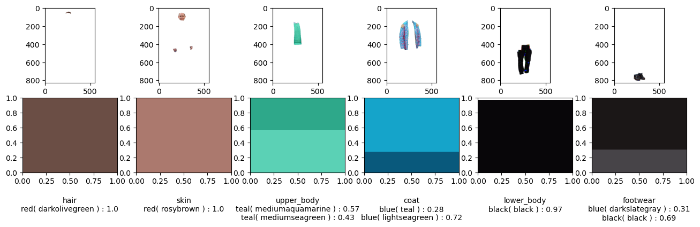

# Clothing color extraction with Self Correction Human Parsing


 

This repo consists of a notebook(demo.ipynb) added to the Self Correction Human Parsing(SCHP) to showcase the use of this model to extract color information from articles of clothing on a person.

Before running the notebook:
- [x] See requirements below and follow instructions to install required modules.
- [x] Install the model checkpoints from the SCHP [repo](https://github.com/GoGoDuck912/Self-Correction-Human-Parsing.git) and move it into the "checkpoints" folder
- [x] Move any images to test on into the "test_images" folder 


## Self Correction for Human Parsing


[](https://opensource.org/licenses/MIT)

An out-of-box human parsing representation extractor.
for more information visit the SCHP repo [here](https://github.com/GoGoDuck912/Self-Correction-Human-Parsing.git).

Our solution ranks 1st for all human parsing tracks (including single, multiple and video) in the third LIP challenge!

 

Features:
- [x] Out-of-box human parsing extractor for other downstream applications.
- [x] Pretrained model on three popular single person human parsing datasets.
- [x] Training and inferecne code.
- [x] Simple yet effective extension on multi-person and video human parsing tasks.

## Requirements

```
conda env create -f environment.yaml
conda activate schp
pip install -r requirements.txt

```

Additional requirements(install via pip):
- [x] pydensecrf
- [x] webcolors
- [x] colormath


## Citation

This repo is a fork of Self-Correction for Human Parsing.

```latex
@article{li2020self,
  title={Self-Correction for Human Parsing}, 
  author={Li, Peike and Xu, Yunqiu and Wei, Yunchao and Yang, Yi},
  journal={IEEE Transactions on Pattern Analysis and Machine Intelligence}, 
  year={2020},
  doi={10.1109/TPAMI.2020.3048039}}
```

## Visualization

* Source Image.


